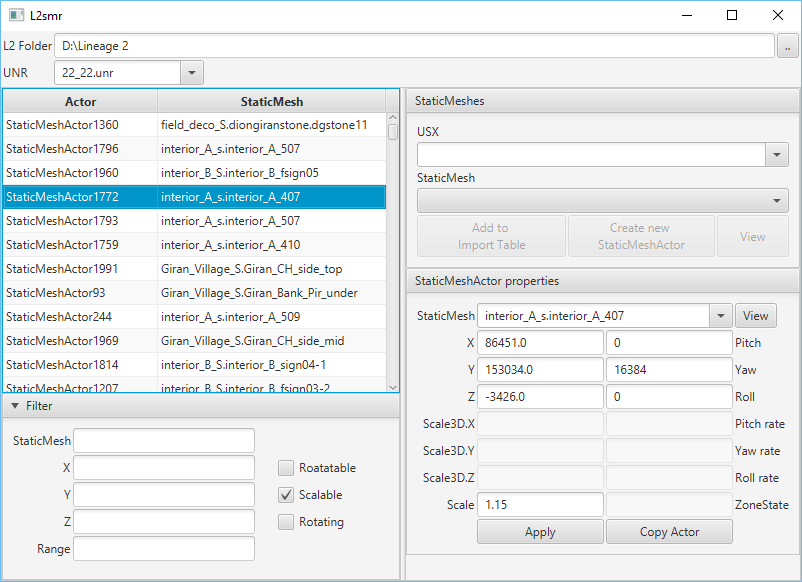

L2smr
=====
Tool for adding/editing StaticMesh actors.



## Build & Run

This project has been updated to work with **Java 17** and **Gradle 8.10**.

### Changes made:
- ✅ Updated Gradle from 2.11 → 8.10 (Java 17 compatible)
- ✅ Modernized `build.gradle` syntax 
- ✅ Added full JavaFX support
- ✅ Fixed compatibility issues

### Build:
```bash
./gradlew build
```

### Run:
```bash
.\run.bat
```

**Note:** The `run.bat` script automatically downloads JavaFX and runs the application.

### Manual execution:
```bash
java -jar build/libs/L2smr.jar
```

## Credits

**Original project:** [acmi/L2smr](https://github.com/acmi/L2smr)  
**Java 17 compilation and update:** [ak4n1](https://github.com/jeep12)

This is a fork updated to work with Java 17 and modern Gradle. All original functionality and code belongs to the [acmi](https://github.com/acmi) team.

---

## Original Information

Build & Run (original method)
-----------
```
gradlew build
```
```
java -jar build/libs/L2smr.jar
```